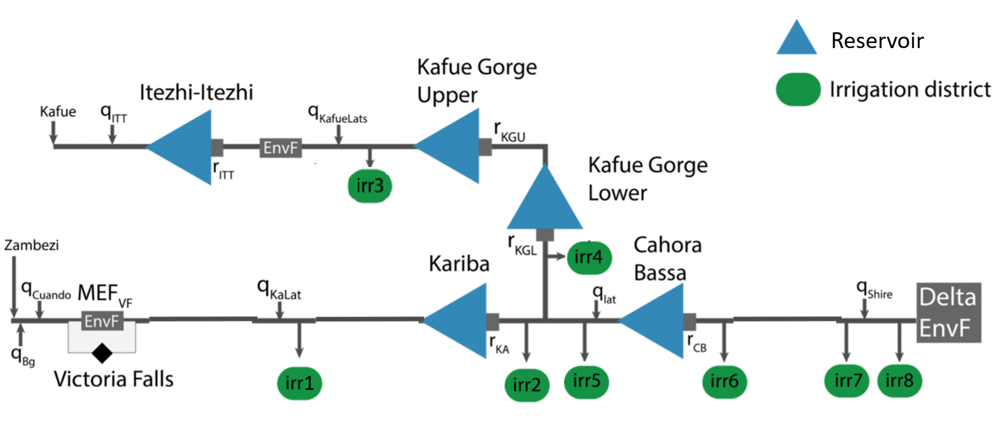

# Multi-objective Multi-reservoir Control Policy Optimisation Model

## Case of Zambezi River Basin

This is not the newest version yet! Git is giving some errors so a lot of files are not uploading at the moment. 

This repository concerns the implementation of the evolutionary multi-objective direct policy search (EMODPS) framework on the hydrologic system of Zambezi River Basin. The model code was originally written in C++ by Arnold, W., Zatarain Salazar, J., Carlino, A., Giuliani, M., & Castelletti, A. (2023) within the scope of the [DAFNE project](https://cordis.europa.eu/project/id/690268). Adaptation of the source code to Python was done by Yasin Sari during his internship at the TPM AI Lab between August - December 2021. Improvements and expansions of this code have been made by Whitley S. Roefs during her Master's thesis Engineering and Policy Analysis in 2024. 

The Zambezi River Basin (ZRB) EMODPS model was created to identify the Pareto-optimal release policies for the five hydropower reservoirs-- namely Itezhi-Itezhi, Kafue Gorge Upper, Kafue Gorge Lower, Kariba and Cahora Bassa (see Figure 1) and eight irrigation districts (numbers 2 through 9) in the river basin. In the baseline configuration, the hydropower deficits of the five reservoirs are aggregated into one hydropower objective and the irrigation deficits at the eight irrigation districts in the system are aggregated into one irrigation objective. The environmental flow at the Zambezi Delta constitutes the third objective for the base case optimization. This research disaggregates the hydropower and irrigation objectives to analyse what the effects are on the optimal release policies, particularly for smaller irrigation districts and reservoirs. The research question is: How does the disaggregation of objectives influence the Pareto space for an EMODPS simulation-optimization model? 

Four levels of aggregation are considered: the baseline configuration with three objectives, the irrigation case with 11 objectives (including an individual objective for each irrigation district), the hydropower case with eight objectives (including the five hydropower reservoirs as objectives) and the full case with 16 objectives in total where the three baseline objectives are complemented with one objective for each irrigation district and hydropower reservoir. The Pareto set of the four different problem framings is visualized and analysed to conduct a comparison between the levels of aggregation.


<figcaption align = "center"><b>Figure 1 - Overview of the modelled system</b></figcaption>

Following the EMODPS methodology, release decisions are made by using a closed loop control policy that returns the decisions conditioned on dynamic inputs. Candidate control policies are initialised as highly parametrised general function approximators such as radial basis functions (RBF) and artificial neural networks (ANN). The aim of the optimisation module is to find the values for the parameters of the release policies for near pareto optimal solutions. Simulation module allows user to obtain the performance metrics and physical quantities of the system by running it with previously optimised policy functions.

## Repository Structure

```
.
└── ZambeziSmashPython/
    ├── data
    ├── notebooks/
    │   ├── Optimization.ipynb                      # Notebook to run the multiobjective optimisation
    │   └── Simulation.ipynb                        # Notebook to run the simulation with a set of policy parameter values
    ├── objs/                                       # Folder where the objective values are printed after running simulation
    │   ├── best_env_simulated.objs
    │   ├── best_hydro_simulated.objs
    │   └── best_irr_simulated.objs
    ├── plots                                       # Folder that contains the graphs of various physical quantities throughout simulation runs
    ├── settings/
    │   └── excel_settings.xlsx                     # File through which user can set most simulation and optimisation setting parameters
    ├── src/
    │   ├── alternative_policy_structures.py        # Contains the class that allows user to specify desired policy function
    │   ├── catchment.py                            # Contains the definition of catchment class which is used to generate irrigation districts
    │   ├── reservoir.py                                 # Contains the definition of lake class which is used to generate different reservoirs
    │   ├── model_zambezi_OPT.py                    # Contains the model definition that includes initialisation and functions (adjusted for optimisation)
    │   ├── model_zambezi_SIM.py                    # Contains the model definition that includes initialisation and functions (adjusted for simulation)
    │   ├── smash.py                                # Contains the policy class that allows user to add as many functions as desired
    │   ├── utils.py                                # Contains functions that provide operational ease
    │   └── various_plots.py                        # Contains functions that are used to plot various graphs of resulting model quantities
    ├── storage_release                             # Folder where physical quantities calculated dynamically within the simulation are saved
    └── testDecisions/                              # Folder that contains already optimised vectors of policy parameters
        ├── decisions_best_env.txt
        ├── decisions_best_hydro.txt
        └── decisions_best_irr.txt
```

## New Features 2022

The main addition to the C++ version of the framework is the novel script called `smash.py` (SMASH standing for Smart Direct Policy Search). This file contains the classes that provide the user with the functionality to create stylised policy functions. The type of a policy function can be either one of the built-in function approximators such as RBF and ANN or a type that is completely specified by the user with the given schema as guidance. The main benefit of the `Policy` class in this file is that it assembles the parameters of the policy functions that are used in various places of the model logic and only then communicates a vector of all parameters to the optimisation engine.

## New Features 2024

The most noteable changes are the debugging of the code, adapting the model for use on Windows and generally greatly expanding both the optimization and the available framework for analysis of the optimization results. The Irrigation, Hydropower and Full cases have all been added with modularity in mind so allow future users to work on the base case (BC) as easily as possible. Most of the files have been adapted in some way, and this model built on ZRB model version of the 16th of February 2022, as later versions did not work. 

Sources: 
Arnold, W., Zatarain Salazar, J., Carlino, A., Giuliani, M., & Castelletti, A. (2023). Operations eclipse sequencing in multipurpose dam planning. Earth's Future, 11(4).
